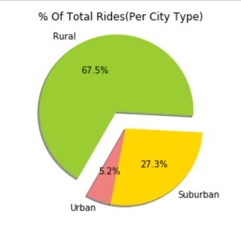

## Ride Sharing Data- Analysis
### Objective:
Analyse the Ride Sharing Data for a Uber company and offer data backed guidance on new opportunities for market differentiation.

### Observable Trends:
 #### Analysis
* Roughly 70% of all rides and total fare value come from Urban riders. 
* Rural riders tend to take significantly higher cost, albeit fewer, trips than Urban or Suburban riders. 
* While comprising of roughly 35% of all rides and fares, Suburban and Rural cities afford only 22% of Pyber's total driver population.

* There may be a strategic opportunity here to boost driver counts in these regions to enhance market share.

### Background:
The ride sharing bonanza continues! 
The company's complete recordset of rides contains information about every active driver and historic ride, including details like city, driver count, individual fares, and city type.

The objective is to build a [Bubble Plot](https://en.wikipedia.org/wiki/Bubble_chart) that showcases the relationship between four key variables:

* Average Fare ($) Per City
* Total Number of Rides Per City
* Total Number of Drivers Per City
* City Type (Urban, Suburban, Rural)

In addition, the following three pie charts are also produced:

### Libraries and tools used:
* Pandas Library and the Jupyter Notebook.
* Matplotlib for all plotting.
* Pyber color scheme (Gold, Light Sky Blue, and Light Coral) in producing the plots and pie charts.
* While creating Bubble Plots, experimented with effects like `alpha`, `edgecolor`, and `linewidths`.
* With Pie Chart, experimented with effects like `shadow`, `startangle`, and `explosion`.

